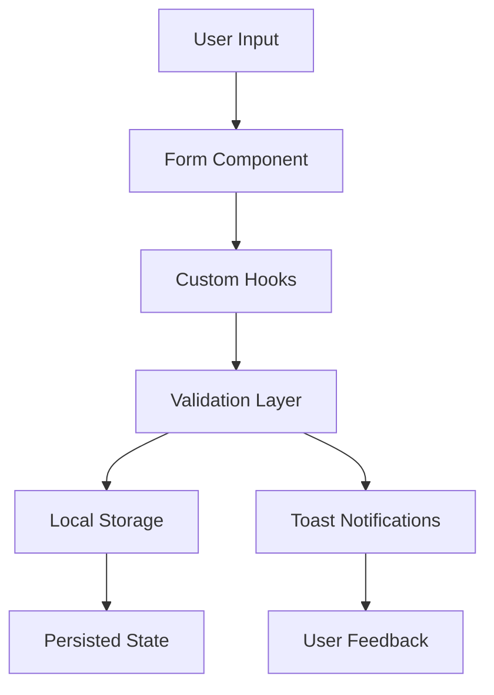

# Color Palette System - Comprehensive Guide

> **Complete technical documentation for the Color Palette Management System in Raycast's Color Picker Extension**

## Table of Contents

1. [Overview](#overview)
2. [Architecture](#architecture)
3. [Core Components](#core-components)
4. [Custom Hooks](#custom-hooks)
5. [Type System](#type-system)
6. [Validation System](#validation-system)
7. [User Experience Features](#user-experience-features)
8. [Implementation Patterns](#implementation-patterns)
9. [Troubleshooting](#troubleshooting)
10. [Code Examples](#code-examples)

---

## Overview

The Color Palette System extends Raycast's Color Picker extension with comprehensive palette creation, management, and organization capabilities. Built with React, TypeScript, and Raycast's UI framework, it provides a professional-grade palette workflow with advanced features like multi-color selection, smart validation, keyword management, and intelligent form handling.

### Key Features

- ✅ **Multi-Color Selection** - Select colors from history or AI-generated colors
- ✅ **Smart Form Initialization** - Priority-based field population (drafts → selected colors → defaults)
- ✅ **Advanced Keyword Management** - Global keyword storage with add/remove syntax
- ✅ **Comprehensive Validation** - HEX-only colors, keyword validation with detailed feedback
- ✅ **Intelligent Toast Notifications** - Context-aware success/error messages
- ✅ **Real-Time Focus Tracking** - Enhanced UX with dynamic focus management
- ✅ **Race Condition Prevention** - Robust state management with proper async handling
- ✅ **Draft Restoration** - Seamless form state persistence

---

## Architecture

### High-Level Design Philosophy

The system follows **separation of concerns** principles with:

- **Custom Hooks** for business logic encapsulation
- **Reusable Components** for UI consistency
- **Centralized Types** for maintainable TypeScript
- **Validation Layer** for data integrity
- **Smart State Management** for optimal performance

### File Structure

```
src/
├── save-color-palette.tsx           # Main form component
├── components/
│   ├── KeywordsSection.tsx         # Keyword management UI
│   ├── ColorFieldsSection.tsx     # Dynamic color fields
│   └── ColorPaletteActions.tsx    # Form actions panel
├── hooks/
│   ├── useSelection.ts             # Multi-color selection logic
│   ├── useKeywords.ts             # Global keyword management
│   ├── useColorFields.ts          # Dynamic field management
│   ├── usePaletteSubmission.ts    # Form submission logic
│   └── useRealTimeFocus.ts        # Focus tracking
├── types.ts                       # Centralized type definitions
├── utils/
│   ├── formValidation.ts          # Validation rules
│   └── keywordValidation.ts       # Keyword-specific validation
└── constants.ts                   # Default values and constants
```

### Data Flow Architecture



_[SCREENSHOT PLACEHOLDER: Architecture diagram showing component relationships]_

---

## Core Components

### 1. save-color-palette.tsx (Main Form)

**Purpose**: Orchestrates the entire palette creation workflow

**Key Features**:

- Smart form initialization with priority system
- Memoized initial values for performance
- Race condition prevention in focus management
- Integration of all custom hooks

**Implementation Highlights**:

```tsx
// Priority-based initialization
const initialValues = useMemo((): PaletteFormFields => {
  const values: PaletteFormFields = { ...CLEAR_FORM_VALUES };

  // Priority 1: Draft values (highest)
  if (draftValues) {
    Object.assign(values, draftValues);
    return values;
  }

  // Priority 2: Selected colors
  if (selectedColors.length > 0) {
    // Handle AI prompt intelligently
    if (AIprompt) {
      if (AIprompt.length < 16) {
        values.name = AIprompt;
      } else {
        values.description = AIprompt;
      }
    }

    selectedColors.forEach((color, index) => {
      values[`color${index + 1}`] = color.color;
    });
    return values;
  }

  // Priority 3: Defaults
  return values;
}, [draftValues, selectedColors, AIprompt]);
```

**Race Condition Prevention Example**:

```tsx
// ❌ PROBLEMATIC: Race condition
const handleAddColorField = () => {
  addColorField(); // Async state update
  const fieldId = `color${colorFieldCount + 1}`; // Stale value!
  setFocusedField(fieldId);
};

// ✅ CORRECT: Pre-calculate before state update
const handleAddColorField = () => {
  const newColorFieldId = `color${colorFieldCount + 1}`; // Current value
  addColorField(); // State update after calculation
  setTimeout(() => setFocusedField(newColorFieldId), 50);
};
```

### 2. KeywordsSection.tsx

**Purpose**: Dual-interface keyword management with tag picker and text input

**Key Features**:

- Global keyword storage integration
- Smart toast feedback based on operation results
- Add/remove syntax with `!keyword` support
- Real-time validation feedback

**Smart Toast Logic**:

```tsx
// Determines appropriate toast based on actual results
if (totalSuccessful === 0 && totalProcessed > 0) {
  // All failed - show appropriate error
  if (hasInvalid && hasDuplicates) {
    showToast({
      style: Toast.Style.Failure,
      title: "No keywords updated",
      message: `${invalidKeywords.length} invalid, ${duplicateKeywords.length} duplicate keywords`,
    });
  }
} else if (totalSuccessful > 0 && (hasInvalid || hasDuplicates)) {
  // Partial success - informative warning
  showToast({
    style: Toast.Style.Success,
    title: `${totalSuccessful} keywords updated`,
    message: hasInvalid
      ? `${invalidKeywords.length} invalid keywords skipped`
      : `${duplicateKeywords.length} duplicates skipped`,
  });
}
```

_[SCREENSHOT PLACEHOLDER: KeywordsSection showing tag picker and text input]_

### 3. ColorFieldsSection.tsx

**Purpose**: Dynamic color field management with auto-focus support

**Key Features**:

- Dynamic field addition/removal
- Auto-focus for draft restoration
- Real-time focus tracking integration
- Seamless field management

_[SCREENSHOT PLACEHOLDER: ColorFieldsSection with multiple color fields]_

---

## Custom Hooks

### 1. useSelection.ts

**Purpose**: Reusable multi-item selection logic

**Problem Solved**: Object reference equality issues with React state
**Solution**: ID-based selection tracking

```tsx
// ❌ Object reference comparison fails
const [selectedItems, setSelectedItems] = useState<Set<ColorItem>>(new Set());
const isSelected = selectedItems.has(item); // Always false!

// ✅ ID-based tracking works reliably
const [selectedIds, setSelectedIds] = useState<Set<string>>(new Set());
const isSelected = selectedIds.has(item.id); // Reliable!
```

**Key Implementation**:

```tsx
const getIsItemSelected = useCallback(
  (item: ColorItem): boolean => {
    return selectedIds.has(item.id);
  },
  [selectedIds],
);

const toggleSelection = useCallback((item: ColorItem) => {
  setSelectedIds((prev) => {
    const newSet = new Set(prev);
    if (newSet.has(item.id)) {
      newSet.delete(item.id);
    } else {
      newSet.add(item.id);
    }
    return newSet;
  });
}, []);
```

### 2. useKeywords.ts

**Purpose**: Global keyword management with smart parsing

**Key Features**:

- Persistent global keyword storage
- Comma-separated parsing with trimming
- Removal syntax (`!keyword`)
- Detailed operation feedback via `KeywordUpdateResult`

**Smart Parsing Logic**:

```tsx
const updateKeywords = async (keywordsText: string): Promise<KeywordUpdateResult> => {
  // Parse and clean input
  const inputKeywords = keywordsText
    .split(",")
    .map((keyword) => keyword.trim())
    .filter(Boolean);

  // Separate add and remove operations
  const addKeywords = inputKeywords.filter((k) => !k.startsWith("!"));
  const removeKeywords = inputKeywords.filter((k) => k.startsWith("!")).map((k) => k.slice(1));

  // Process removals first, then additions
  // Return detailed feedback for smart UI updates
};
```

**Smart Toast Feedback Matrix**:

| Scenario                  | Toast Type | Example Message                                                           |
| ------------------------- | ---------- | ------------------------------------------------------------------------- |
| All invalid               | 🔴 Failure | "Invalid keywords: xyz - must be 2-20 chars, alphanumeric + hyphens only" |
| All duplicates            | 🟡 Success | "No new keywords: blue, red already exist"                                |
| Mixed invalid/duplicates  | 🔴 Failure | "No keywords updated: 2 invalid, 1 duplicate keywords"                    |
| Partial success           | 🟡 Success | "2 keywords updated: 1 invalid keywords skipped"                          |
| Complete success (add)    | 🟢 Success | "Keywords added: ocean, sunset"                                           |
| Complete success (remove) | 🟢 Success | "Keywords removed: old-tag"                                               |
| Complete success (mixed)  | 🟢 Success | "Keywords updated: 2 added, 1 removed"                                    |

### 3. useColorFields.ts

**Purpose**: Dynamic color field management

**Key Features**:

- Configurable initial field count
- Add/remove operations
- Reset functionality
- Minimum field enforcement (always at least 1)

### 4. usePaletteSubmission.ts

**Purpose**: Encapsulates palette submission logic

**Key Features**:

- Form data transformation
- Local storage persistence
- Success/error handling
- Post-submission cleanup

### 5. useRealTimeFocus.ts

**Purpose**: Real-time focus tracking for enhanced UX

**Key Features**:

- Current focused field tracking
- Focus change handlers
- Race condition prevention in blur events
- Ref-based state management for stale closure prevention

```tsx
const createFocusHandlers = useCallback(
  (fieldId: string) => {
    return {
      onFocus: () => setFocusedField(fieldId),
      onBlur: () => {
        // Prevent race conditions
        if (focusedFieldRef.current === fieldId) {
          setFocusedField(null);
        }
      },
    };
  },
  [setFocusedField],
);
```

---

## Type System

### Core Types Overview

```tsx
// Color selection types
export type ColorItem = {
  id: string;
  color: string; // HEX format
};

// Form data structure
export type PaletteFormFields = {
  name: string;
  description: string;
  mode: string;
  keywords: string[];
  [key: `color${number}`]: string; // Dynamic color fields
};

// Storage format
export type StoredPalette = {
  id: string;
  name: string;
  description: string;
  mode: "light" | "dark"; // Strictly typed
  keywords: string[];
  colors: string[]; // Array format for storage
  createdAt: string; // ISO timestamp
};

// Keyword operation results
export type KeywordUpdateResult = {
  validKeywords: string[];
  invalidKeywords: string[];
  removedKeywords: string[];
  duplicateKeywords: string[];
  totalProcessed: number;
};
```

### Selection System Types

```tsx
export type UseSelectionReturn = {
  actions: {
    toggleSelection: (item: ColorItem) => void;
    selectAll: () => void;
    clearSelection: () => void;
  };
  selected: {
    selectedItems: Set<ColorItem>;
    anySelected: boolean;
    allSelected: boolean;
    countSelected: number;
  };
  helpers: {
    getIsItemSelected: (item: ColorItem) => boolean;
  };
};
```

---

## Validation System

### Form Validation Rules

**HEX Color Validation**:

```tsx
// Strict HEX-only validation
const isValidHexColor = (color: string): boolean => {
  return /^#[0-9A-Fa-f]{6}$/.test(color);
};

// Dynamic validation for color fields
export const createValidationRules = (colorFieldCount: number) => {
  const rules: any = {
    name: FormValidation.Required,
    mode: FormValidation.Required,
  };

  // Add validation for each color field
  for (let i = 1; i <= colorFieldCount; i++) {
    rules[`color${i}`] = (value: string) => {
      if (!value?.trim()) return "Color is required";
      if (!isValidHexColor(value)) return "Must be valid HEX color (e.g., #FF5733)";
    };
  }

  return rules;
};
```

### Keyword Validation Rules

```tsx
// Comprehensive keyword validation
export const isValidKeyword = (keyword: string): boolean => {
  const trimmed = keyword.trim();

  // Length validation (2-20 characters)
  if (trimmed.length < 2 || trimmed.length > 20) return false;

  // Character validation (alphanumeric + hyphens)
  if (!/^[a-zA-Z0-9-]+$/.test(trimmed)) return false;

  return true;
};

export const filterValidKeywords = (keywords: string[]): string[] => {
  return keywords.filter(isValidKeyword);
};
```

---

## User Experience Features

### 1. Smart Form Initialization

**Draft Priority System**:

1. **Highest Priority**: Saved draft values
2. **Medium Priority**: Selected colors from other commands
3. **Lowest Priority**: Default empty values

**AI Prompt Integration**:

- Short prompts (< 16 chars) → Name field
- Long prompts (≥ 16 chars) → Description field

### 2. Real-Time Focus Management

**Auto-Focus for Draft Restoration**:

```tsx
const getAutoFocusField = (): string | null => {
  if (!draftValues) return null;

  const colorKeys = Object.keys(draftValues).filter((key) => key.startsWith("color"));
  const filledColors = colorKeys.filter((key) => draftValues[key]);

  if (filledColors.length > 0) {
    const lastIndex = Math.max(...filledColors.map((key) => parseInt(key.replace("color", ""))));
    const nextIndex = lastIndex + 1;
    return nextIndex <= colorFieldCount ? `color${nextIndex}` : `color${colorFieldCount}`;
  }

  return "color1";
};
```

### 3. Dynamic Color Field Management

**Add Field Logic**:

- Pre-calculate field ID to prevent race conditions
- Auto-focus on newly added field
- Smooth UX with proper timing

**Remove Field Logic**:

- Clear form value before UI removal
- Focus on previous field
- Maintain minimum of 1 field

### 4. Intelligent Toast Notifications

**Context-Aware Messaging**:

- Different toast styles based on operation results
- Detailed feedback for partial operations
- Clear validation error explanations
- No misleading success messages

_[SCREENSHOT PLACEHOLDER: Toast notification examples]_

---

## Implementation Patterns

### 1. Race Condition Prevention

**Problem**: React state updates are asynchronous
**Solution**: Pre-calculate values before state changes

```tsx
// ❌ Race condition prone
const handleAction = () => {
  setCount((prev) => prev + 1);
  const newValue = count + 1; // Stale value!
  doSomethingWith(newValue);
};

// ✅ Race condition safe
const handleAction = () => {
  const newValue = count + 1; // Calculate first
  setCount(newValue);
  doSomethingWith(newValue);
};
```

### 2. Memoization for Performance

**Form Initialization Memoization**:

```tsx
const initialValues = useMemo((): PaletteFormFields => {
  // Expensive computation only when dependencies change
  return computeInitialValues();
}, [draftValues, selectedColors, AIprompt]);
```

### 3. Hook Composition Pattern

**Single Responsibility Hooks**:

- Each hook handles one concern
- Clear interfaces between hooks
- Testable and maintainable

### 4. Stale Closure Prevention

**Ref-Based State Management**:

```tsx
const focusedFieldRef = useRef<string | null>(null);

const createHandlers = useCallback((fieldId: string) => {
  return {
    onBlur: () => {
      // Use ref to avoid stale closure
      if (focusedFieldRef.current === fieldId) {
        setFocusedField(null);
      }
    },
  };
}, []);
```

---

## Troubleshooting

### Common Issues and Solutions

#### 1. Selection Not Working

**Symptom**: Items appear selected but don't stay selected
**Cause**: Object reference equality issues
**Solution**: Use ID-based selection tracking

#### 2. Focus Management Issues

**Symptom**: Auto-focus not working or focusing wrong field
**Cause**: Race conditions with state updates
**Solution**: Pre-calculate field IDs and use setTimeout for DOM updates

#### 3. Toast Messages Incorrect

**Symptom**: Success toasts when nothing was updated
**Cause**: Not checking actual operation results
**Solution**: Use detailed `KeywordUpdateResult` object for precise feedback

#### 4. Form Values Not Persisting

**Symptom**: Draft values not restored correctly
**Cause**: Incorrect initialization priority
**Solution**: Follow draft → selected → defaults priority system

---

## Code Examples

### Complete Hook Integration Example

```tsx
export default function SaveColorPalette(props: PaletteFormProps) {
  const { draftValues } = props;
  const selectedColors = props.launchContext?.selectedColors || [];

  // Initialize with priority system
  const initialValues = useMemo(() => computeInitialValues(draftValues, selectedColors), [draftValues, selectedColors]);

  // Hook composition
  const { colorFieldCount, addColorField, removeColorField } = useColorFields(initialColorFieldCount);
  const { keywords, updateKeywords } = useKeywords(draftValues);
  const { submitPalette } = usePaletteSubmission();
  const { currentFocusedField, createFocusHandlers, setFocusedField } = useRealTimeFocus();

  // Form integration
  const { handleSubmit, itemProps, reset, setValue } = useForm({
    onSubmit: async (values) => {
      await submitPalette({
        formValues: values,
        colorCount: colorFieldCount,
        onSubmit: handleClearForm,
      });
    },
    validation: createValidationRules(colorFieldCount),
    initialValues,
  });

  return (
    <Form actions={<Actions />} enableDrafts>
      {/* Form fields with focus tracking */}
      <Form.TextField {...itemProps.name} {...createFocusHandlers("name")} />

      <KeywordsSection
        keywords={keywords}
        itemProps={itemProps}
        updateKeywords={updateKeywords}
        createFocusHandlers={createFocusHandlers}
      />

      <ColorFieldsSection
        colorFieldCount={colorFieldCount}
        itemProps={itemProps}
        autoFocusField={getAutoFocusField()}
        currentFocusedField={currentFocusedField}
        createFocusHandlers={createFocusHandlers}
      />
    </Form>
  );
}
```

### Selection Hook Usage

```tsx
// In organize-colors.tsx or generate-colors.tsx
const { actions, selected, helpers } = useSelection(colorItems);

const handleSelectAll = () => actions.selectAll();
const handleClearSelection = () => actions.clearSelection();

// In grid item rendering
const isSelected = helpers.getIsItemSelected(colorItem);
const handleToggle = () => actions.toggleSelection(colorItem);
```

### Keyword Management Example

```tsx
const { keywords, updateKeywords } = useKeywords();

const handleKeywordInput = async (input: string) => {
  const result = await updateKeywords(input);

  // Smart toast based on results
  if (result.validKeywords.length > 0) {
    showToast({
      style: Toast.Style.Success,
      title: "Keywords added",
      message: result.validKeywords.join(", "),
    });
  }

  if (result.invalidKeywords.length > 0) {
    showToast({
      style: Toast.Style.Failure,
      title: "Invalid keywords",
      message: `${result.invalidKeywords.join(", ")} - must be 2-20 chars, alphanumeric + hyphens only`,
    });
  }
};
```

---

## Performance Considerations

### 1. Memoization Strategy

- **Form initialization**: Memoized to prevent unnecessary recalculation
- **Validation rules**: Dynamically generated but cached
- **Event handlers**: useCallback for stable references

### 2. State Update Optimization

- **Batched updates**: React automatically batches state updates
- **Minimal re-renders**: Proper dependency arrays in hooks
- **Ref usage**: Avoiding stale closures without triggering re-renders

### 3. Storage Efficiency

- **Global keyword storage**: Shared across all palettes
- **Efficient serialization**: Simple data structures for localStorage
- **Incremental updates**: Only update changed data

---

## Future Enhancements

### Potential Improvements

1. **Palette Viewing/Editing**: Browse and modify saved palettes
2. **Import/Export**: Share palettes between users
3. **Color Harmony Analysis**: Suggest complementary colors
4. **Advanced Search**: Filter palettes by keywords, colors, or mode
5. **Palette Collections**: Group related palettes together
6. **Color Accessibility**: WCAG compliance checking
7. **Undo/Redo**: Action history for better UX

### Extension Points

- **Custom Validation Rules**: Plugin system for validation
- **Storage Backends**: Support for cloud storage
- **Color Format Support**: RGB, HSL, etc. in addition to HEX
- **Batch Operations**: Multi-palette management
- **Analytics**: Usage tracking and insights

---

## Conclusion

The Color Palette System represents a comprehensive, production-ready solution for palette management in Raycast. It demonstrates advanced React patterns, robust TypeScript usage, and excellent user experience design. The modular architecture ensures maintainability and extensibility for future enhancements.

**Key Achievements**:

- ✅ **Robust Architecture**: Separation of concerns with custom hooks
- ✅ **Excellent UX**: Smart initialization, real-time feedback, intuitive workflows
- ✅ **Type Safety**: Comprehensive TypeScript coverage
- ✅ **Error Handling**: Graceful degradation and clear error messages
- ✅ **Performance**: Optimized with memoization and efficient state management
- ✅ **Maintainability**: Well-documented, testable, and modular code

The system is ready for production use and provides a solid foundation for future palette-related features in the Raycast Color Picker extension.

---

_This documentation is maintained alongside the codebase. For questions or contributions, please refer to the project's contribution guidelines._
